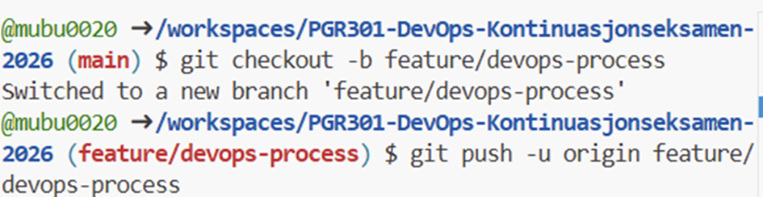

Oppgave 1 – DevOps-prosess for team (20 poeng) Branch-strategi
Main-branch skal alltid representere produksjonsklar kode. Det betyr at main til enhver tid skal være stabil, testet og klar til deploy. Ingen utvikling skal skje direkte på main. All ny funksjonalitet, feilretting og tekniske forbedringer skal utvikles i egne branches.
Teamet bruker følgende branch-typer:
•	feature/* for nye funksjoner
•	fix/* for bugfixer
•	chore/* for tekniske endringer (CI/CD, Docker, oppsett, etc.)
En ny branch opprettes hver gang man starter på en ny oppgave. Dette gjelder blant annet når man:
•	legger til tester
•	endrer Dockerfile
•	fikser en bug
•	lager en ny feature
•	endrer CI/CD
En enkel regel i teamet er at én branch skal brukes per oppgave. Dette gjør det enklere å holde oversikt og reduserer risikoen for at flere endringer blandes sammen.
Branchene navngis på en strukturert og beskrivende måte, for eksempel:
•	feature/add-unit-tests
•	feature/github-actions-ci
•	fix/docker-entrypoint
•	chore/trivy-scan
Dette er viktig når teamet vokser fra én til flere utviklere. Dårlige eller utydelige navn kan føre til misforståelser, mens gode navn er selvforklarende, enkle å spore og gir et ryddig og profesjonelt inntrykk.
Pull Request-prosess
En Pull Request (PR) skal opprettes når arbeidet i branchen er ferdig, koden fungerer lokalt og er klar for gjennomgang. I tillegg skal relevante tester være skrevet og bestått før PR opprettes.
Pull Requests fungerer som en kvalitetssikring før kode merges til main. Dette er spesielt viktig i et prosjekt hvor AI-verktøy kan brukes til å generere kode raskt. Selv om AI øker produktiviteten, kan det også introdusere dårlige løsninger, sårbarheter eller suboptimale konfigurasjoner.
I et team på 3–5 utviklere bør minst én annen utvikler gjennomgå og godkjenne PR før merge. Ideelt sett kunne to godkjenninger vært ønskelig for ekstra kvalitetssikring, men i dette prosjektet er minimum én godkjenning tilstrekkelig.
Før en Pull Request kan merges må følgende være oppfylt:
•	Minst én godkjenning
•	Ingen merge conflicts
•	CI pipeline må være grønn
•	Ingen kritiske eller alvorlige sårbarheter Dette sikrer at main forblir stabil og at kvaliteten ikke avhenger av enkeltpersoner.
Branch Protection
For å sikre at reglene faktisk følges, er det konfigurert branch protection på main-branch.
Følgende regler er aktivert:
•	Require pull request before merging
•	Require at least 1 approving review
•	Block force pushes
•	Restrict deletions
•	Dismiss stale pull request approvals when new commits are pushed
Disse reglene hindrer direkte push til main og sørger for at all kode går gjennom Pull Request-prosessen. Dette er viktig når teamet vokser, da det skaper struktur og forutsigbarhet.
Dismiss stale pull request approvals when new commits are pushed er spesielt viktig fordi en tidligere godkjenning ikke skal gjelde dersom ny kode pushes etter review. Dette forhindrer at man ubevisst omgår kvalitetssikringen.
Require status checks to pass vil bli aktivert etter at CI/CD-pipeline er etablert i Oppgave 3, siden GitHub krever at minst én status check eksisterer før regelen kan håndheves.
Automatisering
Automatisering er en sentral del av DevOps-prosessen. Når utviklingshastigheten øker, spesielt med bruk av AI-verktøy, må kvalitetssikringen også være automatisert.
Følgende automatiske sjekker skal kjøres:
På Pull Request:
•	mvn test
•	mvn package
•	Bygging av Docker image
•	Trivy filesystem scan
•	Trivy image scan
•	Pipeline skal feile ved HIGH eller CRITICAL sårbarheter
•	Generering av SARIF-rapport
Dette sikrer at kode kvalitetssikres før den merges til main.
På push til main:
•	mvn test
•	mvn package
•	Bygging av Docker image
•	Push av Docker image til Docker Hub
Ved å skille mellom PR-validering og main-build sikres det at kun verifisert og sikker kode blir publisert videre.
Automatiseringen gjør at kvalitet og sikkerhet ikke kun baseres på manuell kontroll, men håndheves konsekvent gjennom pipeline.
Dokumentasjon av konfigurasjon
Jeg har:
Opprettet en egen feature-branch for Oppgave 1 og pushet den til GitHub
Konfigurert branch protection på default branch (main)
Aktivert krav om Pull Request og minst én godkjenning før merge
Skjermbilder som viser opprettelse av branch og konfigurering av branch protection er inkludert under.

Som informert, kan jeg ikke legge til 'Require status cheks to pass' før oppgave 3. 